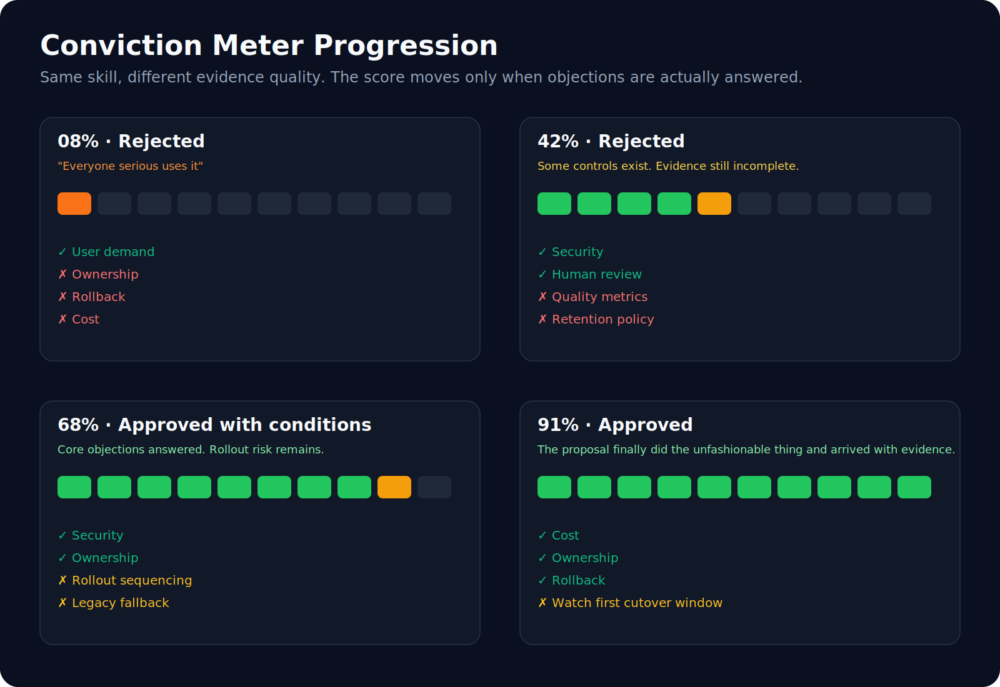
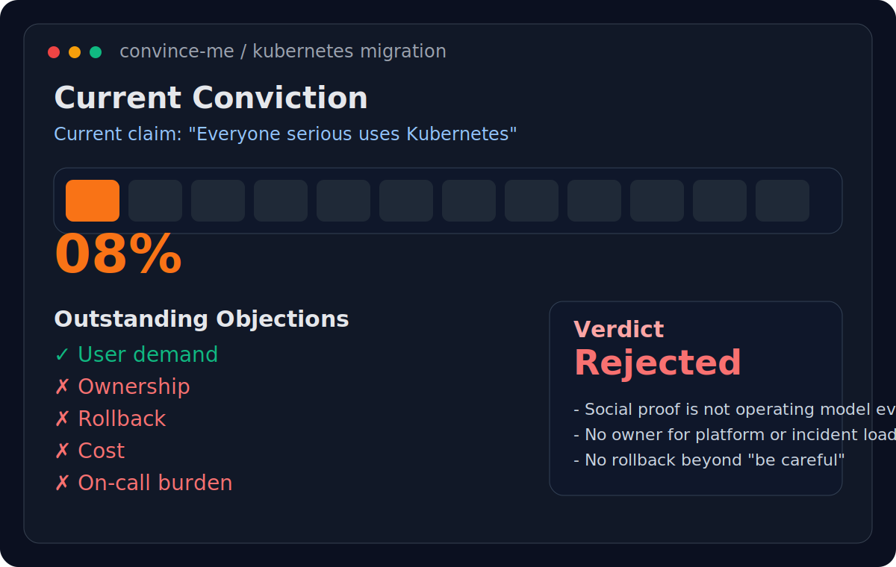
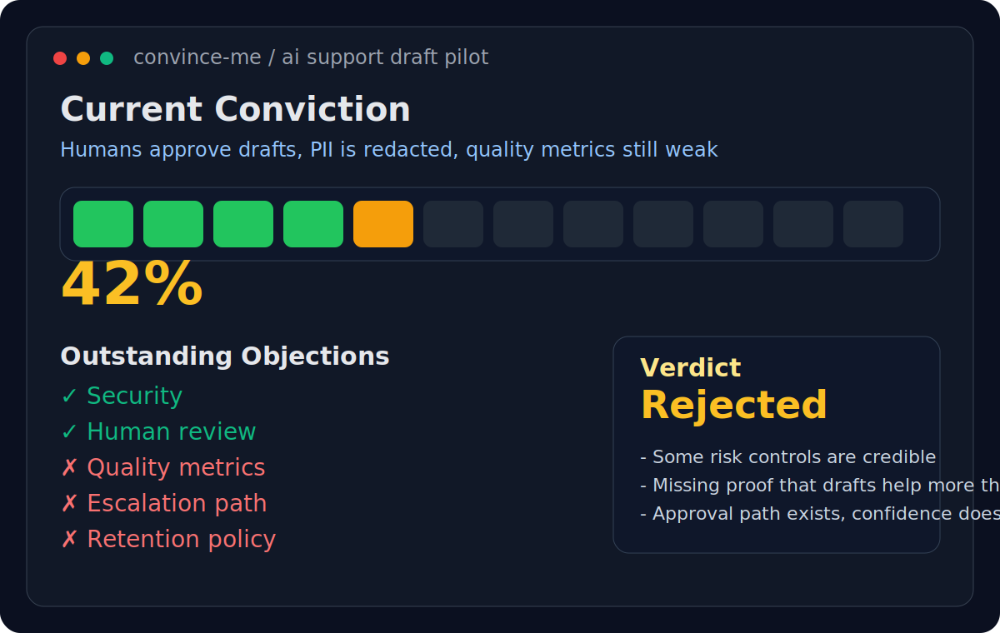
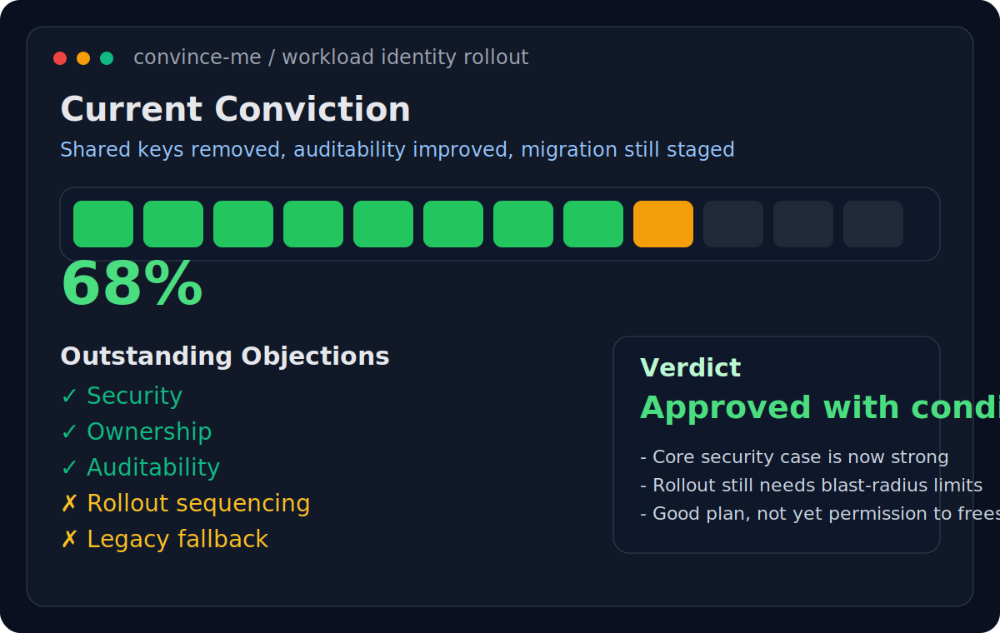
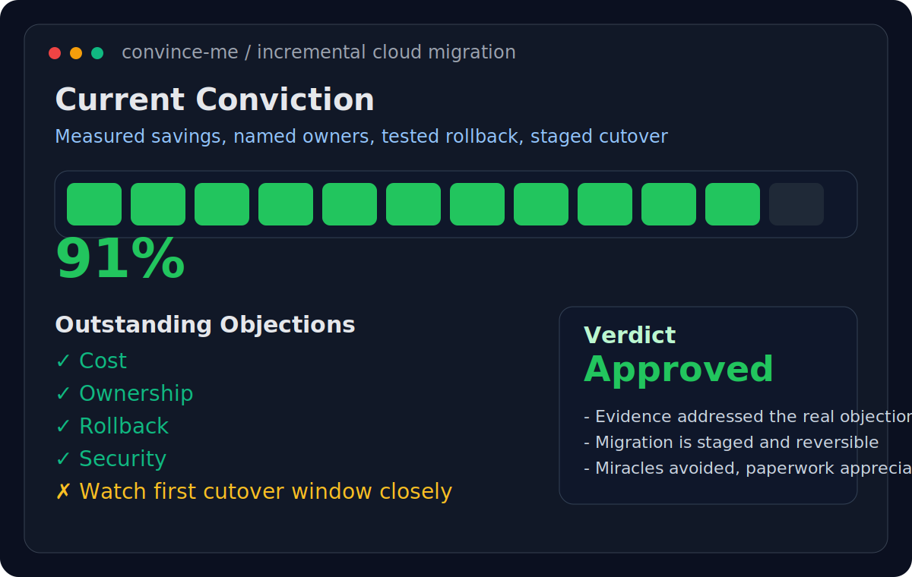

# Convince Me

An engineering review game with a visible scoreboard.

This skill is useful when a team keeps circling around opinions and needs a transparent mechanism for what has, and has not, been proven.

It is deliberately theatrical in one narrow way: every claim has to move the meter.

If a proposal is strong, the score will rise quickly.

If the proposal is hand-waving in a nice blazer, everyone gets to watch that happen in public.

## Best For

- architecture debates
- migration proposals
- platform bets
- vendor selection
- AI initiatives

## Signature Behavior

Starts at `0%` conviction and makes you earn every increase.

## Why People Install It

- It turns vague debates into explicit objections.
- It rewards evidence instead of repetition.
- It gives teams a memorable shared artifact: the current conviction score.
- It is much harder to hide behind "generally speaking" once the meter is involved.

## Visual Examples

### Progression Overview

### Individual Screens

Low conviction, mostly vibes:

Partial answers, still rejected:

Strong proposal, rollout still conditional:

Evidence-heavy approval:

